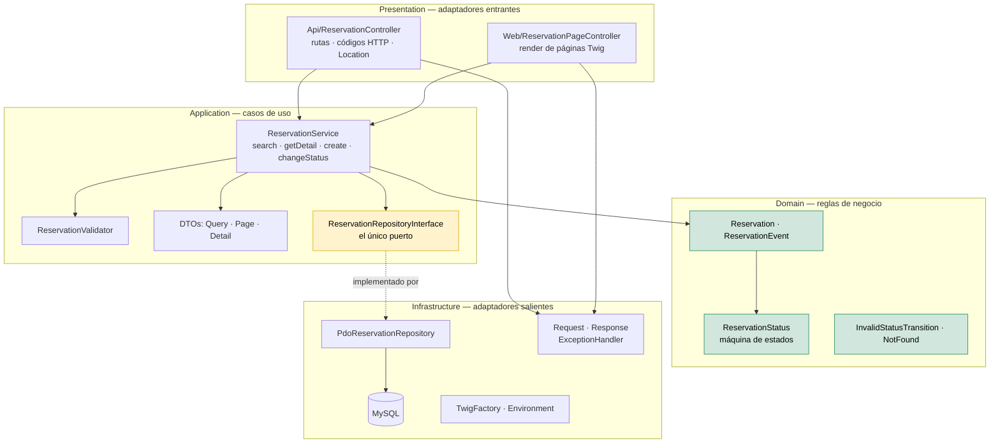
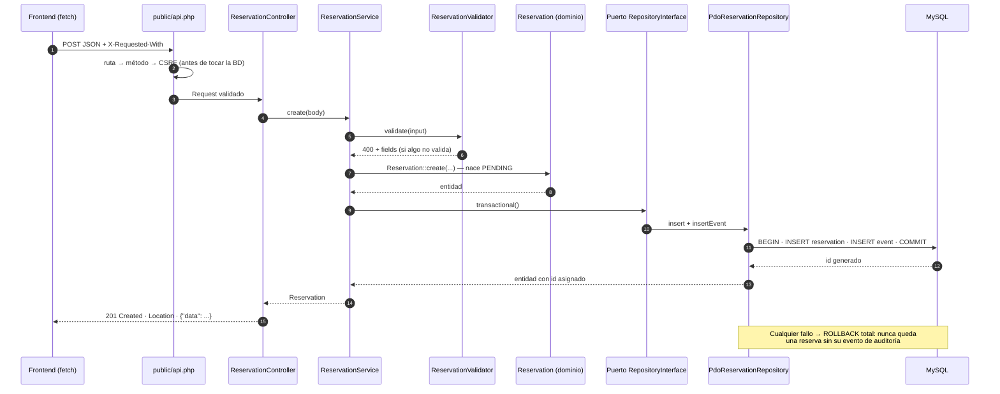
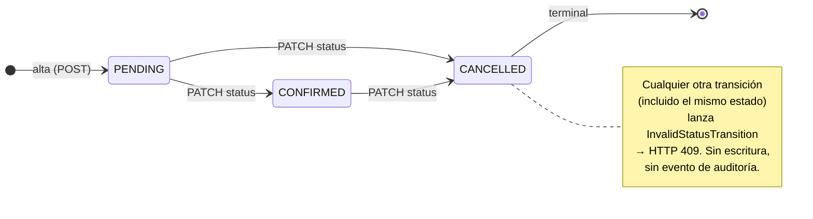

# Reservas de alojamiento — Prueba técnica (MisterPlan)

Aplicación de gestión de reservas construida **sin framework**: API en PHP 8.3+ nativo, vistas en servidor con Twig, e interfaz en JavaScript vanilla (módulos ES) que consume la API **sin recargar la página**. MySQL como base de datos y PHPUnit para los tests.

> **Arquitectura**: capas hexagonal-*lite* en 4 niveles con **un único puerto** (`ReservationRepositoryInterface`) — el dominio no depende de nada y la persistencia se sustituye o se testea sin tocar una línea de lógica de negocio. La sección [Arquitectura](#arquitectura) es el corazón de este README.
>
> **Estado**: 36 tests / 62 assertions en verde · API y vistas verificadas end-to-end contra MySQL real.

> **Despliegue:** _pendiente de publicación — esta sección se actualizará con la URL pública en cuanto la app esté desplegada._

---

## Índice

- [Características](#características)
- [Stack tecnológico](#stack-tecnológico)
- [Arquitectura](#arquitectura)
  - [Visión general](#visión-general)
  - [Las cuatro capas](#las-cuatro-capas)
  - [El puerto y el adaptador](#el-puerto-y-el-adaptador)
  - [Recorrido de una petición](#recorrido-de-una-petición)
  - [Máquina de estados](#máquina-de-estados)
  - [Invariantes que la arquitectura garantiza](#invariantes-que-la-arquitectura-garantiza)
  - [Decisiones técnicas](#decisiones-técnicas)
  - [Cómo se extiende](#cómo-se-extiende)
  - [Estructura de carpetas](#estructura-de-carpetas)
- [Puesta en marcha local](#puesta-en-marcha-local)
- [API](#api)
- [Seguridad](#seguridad)
- [Tests](#tests)
- [Qué haría con más tiempo](#qué-haría-con-más-tiempo)
- [Escalabilidad: 1000 reservas/hora](#escalabilidad-1000-reservashora)

---

## Características

- **Listado de reservas** con filtros combinables (estado, rango de fechas con semántica de **solape**, búsqueda por huésped en nombre o email) y paginación, repintado en cliente **sin recargar** (debounce 300 ms, URL sincronizada).
- **Detalle de reserva** con su historial de eventos (timeline de auditoría).
- **Alta de reservas** con validación en cliente y en servidor; los errores del servidor se pintan **campo a campo** bajo cada input.
- **Confirmar / cancelar** desde el listado o el detalle, con confirmación y feedback visual (cargando / éxito / error).
- **Auditoría**: cada creación y cada cambio de estado escribe una fila en `reservation_event` **en la misma transacción** que la reserva.
- Respuestas JSON con códigos HTTP correctos (200, 201, 400, 403, 404, 405, 409, 500) y envelope de error uniforme.

## Stack tecnológico

| Capa | Elección | Por qué |
|---|---|---|
| Lenguaje | PHP >= 8.3 (`strict_types`, enums, `match`, `readonly`) | Requisito de la prueba; tipado estricto en todo `src/` |
| Dependencias | Composer + PSR-4 (`App\ → src/`) | Autoloading estándar, sin framework |
| Base de datos | MySQL 8 / MariaDB vía PDO, **sin emulación de prepares** | Lo pide la prueba y es el motor del core de MisterPlan; prepared statements reales del servidor |
| Vistas | Twig 3 | Herencia de plantillas y autoescaping por defecto |
| Frontend | JavaScript ES modules (vanilla) | Sin librerías ni build step: se sirve tal cual |
| Tests | PHPUnit 11 | Estándar de facto en el ecosistema PHP |
| Servidor (dev) | PHP built-in server + `router.php` | Arranque en un comando, cero configuración |

---

## Arquitectura

### Visión general

Hexagonal-*lite*: **lo justo para el tamaño del reto** — cuatro capas, un puerto, cero patrones de moda (sin CQRS, sin event bus, sin container de inyección). La regla es la **dirección de las dependencias**:



- **`Domain` no depende de nada**: ni de PDO, ni de Twig, ni de HTTP, ni de `Application`. Es PHP puro testeable en milisegundos.
- **`Application` define el puerto** y orquesta; **`Infrastructure` lo implementa** (la flecha punteada es la única que "cruza" de fuera hacia dentro).
- **`Presentation` es deliberadamente delgada**: traduce HTTP ↔ caso de uso y nada más. La composición de objetos (quién recibe qué) ocurre en los front controllers `public/api.php` y `public/index.php`.

### Las cuatro capas

| Capa | Carpeta | Responsabilidad | Lo que **ignora** (a propósito) |
|---|---|---|---|
| **Domain** | `src/Domain/` | Entidades, enums, máquina de estados, excepciones de negocio | Existen PDO, Twig, JSON, HTTP |
| **Application** | `src/Application/` | Casos de uso, validación de entrada, DTOs, **el puerto** de persistencia | Qué motor de BD hay, cómo se pinta la respuesta |
| **Infrastructure** | `src/Infrastructure/` | Adaptadores: repositorio PDO, HTTP (`Request`/`Response`/`ExceptionHandler`), Twig, `.env` | Qué reglas de negocio hay (solo persiste y traduce) |
| **Presentation** | `src/Presentation/` | Controladores finos: API (JSON, códigos, `Location`) y Web (Twig) | Cómo se guarda en BD ni cómo se calcula el dominio |

### El puerto y el adaptador

Toda la persistencia pasa por **un único contrato** en `src/Application/Repository/ReservationRepositoryInterface.php`:

```php
interface ReservationRepositoryInterface
{
    public function findById(int $id): ?Reservation;
    public function findEvents(int $reservationId): array;      // historial, orden cronológico
    public function search(ReservationQuery $query): ReservationPage;
    public function insert(Reservation $reservation): void;     // asigna el id generado
    public function updateStatus(Reservation $reservation): void;
    public function insertEvent(ReservationEvent $event): void;
    public function transactional(callable $operation): mixed;  // atomicidad reserva + evento
}
```

Dos implementaciones, misma interfaz:

| Implementación | Dónde | Para qué |
|---|---|---|
| `PdoReservationRepository` | `src/Infrastructure/Persistence/` | Producción: prepares nativos, binding de parámetros, `LIKE` escapado |
| `FakeReservationRepository` | `tests/Support/` | Tests de aplicación **sin BD**: se ejecutan en milisegundos |

**Beneficio concreto ya en el código**: `ReservationServiceTest` verifica que una transición rechazada no cambia el estado **ni escribe evento**, que la creación escribe su evento, y que nada se persiste si la validación falla — todo ello sin instanciar MySQL. Cambiar MySQL por otro motor sería **un fichero nuevo** (que implemente el puerto) y ninguna modificación en `Domain`, `Application` ni `Presentation`.

### Recorrido de una petición

**Orden de despacho deliberado** en `public/api.php` — la resolución de ruta y la defensa CSRF ocurren **antes** de abrir conexión con la BD, así una petición inválida nunca toca la base de datos (comprobado: con MySQL caído, `GET /api.php/ruta-inexistente` devuelve `404` en JSON, no un 500):

1. **Router** (`router.php`): ficheros estáticos se sirven directamente; `/api.php*` se delega al front controller de la API.
2. **`Request`**: resuelve ruta (`404`) y método (`405` + `Allow`) → verifica CSRF en mutaciones (`400` si no es JSON, `403` si falta `X-Requested-With` o el `Origin` no cuadra) → solo entonces se construye el caso de uso (y la conexión PDO).
3. **Controlador**: parametriza el caso de uso (id, body decodificado, filtros).
4. **`ReservationService`**: valida la entrada (`400` con `fields` por campo) → aplica reglas de dominio (`409` en transición inválida, `404` si no existe) → persiste **en transacción** vía el puerto.
5. **`ExceptionHandler`** (único punto): traduce cada excepción a su código HTTP y envelope JSON; un `500` nunca filtra stack traces (van a `error_log`).
6. **`Response`**: cabeceras (`nosniff`, `no-store`) + cuerpo.

Y el flujo completo de `POST /api.php/reservations` a través de todas las capas:



### Máquina de estados

La regla de transiciones vive en `ReservationStatus::canTransitionTo()` y se aplica **dentro de la entidad** (`Reservation::changeStatus()`), no en la BD ni en el controlador:



La matriz completa (3×3 = 9 combinaciones) está cubierta por `ReservationStatusTest`.

### Invariantes que la arquitectura garantiza

Cosas que **no pueden** pasar aunque se añadan nuevos endpoints mañana:

- ✅ **Nada se persiste a medias**: `transactional()` envuelve `insert/update + insertEvent`; si falla la reserva, no hay evento, y viceversa.
- ✅ **Nadie puede saltarse la máquina de estados**: la única forma de cambiar `status` es `Reservation::changeStatus()`, que lanza excepción de dominio si la transición no está en el `match`.
- ✅ **Ninguna transición inválida escribe en BD**: la regla se evalúa **antes** de la transacción.
- ✅ **Toda mutación deja auditoría**: los dos caminos de escritura (`create`, `changeStatus`) crean su `reservation_event` en la misma transacción.
- ✅ **Los errores tienen forma uniforme**: un único `ExceptionHandler`; ningún controlador decide códigos HTTP por su cuenta.
- ✅ **El dominio es independiente**: se puede testear (y cambiar de BD) sin mocks de framework.

### Decisiones técnicas

| Decisión | Alternativa descartada | Por qué esta |
|---|---|---|
| Capas hexagonal-*lite* con **1 puerto** | Monolito plano (todo en controladores) o hexagonal completo (CQRS, event bus, container) | Proporcionalidad: testeable sin BD y sin ceremonia; nada que explicar de más |
| Reglas de negocio en la **entidad** | `CHECK` solo en BD / stored procedures / lógica en el Service | La regla viaja con el modelo, se testea unitaria y produce el `409` del dominio |
| PDO manual, sin ORM | Doctrine / Eloquent | El reto pide PHP sin framework; control total de las consultas y cero dependencias ocultas |
| **Prepares nativos** (`EMULATE_PREPARES=false`) | Emulación de prepares | El servidor valida el SQL; aquí saltó y se cubrió un bug real (`HY093` con placeholder repetido) |
| Enum *backed* + `match` exhaustivo | Columna de estado libre con `CONSTRAINT` | El compilador/estática y los tests ven todos los casos; los valores coinciden 1:1 con la BD |
| Importes como **cadena decimal** (`"480.00"`) sobre `DECIMAL(10,2)` | `float` en PHP | Cero errores de redondeo binario; el formato español se aplica solo al pintar |
| Auditoría en **tabla** con eventos | Log de ficheros | Es consultable (timeline del detalle) y alimenta futuras métricas |
| Server-render Twig + JS **progresivo** | SPA con build step | Primera pintura instantánea sin JS; los módulos ES enriquecen sin romper si fallan |
| Errores centralizados en `ExceptionHandler` | `try/catch` repetido en cada controlador | Un solo sitio define 400/403/404/405/409/500 y el envelope JSON |
| Naming: **identificadores en inglés**, **textos en español** | Todo en un solo idioma | Código sin ambigüedad para quien lo herede; mensajes coherentes con el usuario hispanohablante |

### Cómo se extiende

| Quiero… | Ficheros que toco | Ficheros que **no** toco |
|---|---|---|
| Añadir un campo a la reserva | `schema.sql` → `Reservation` → `ReservationValidator` → controller + `_row.html.twig` (si se muestra) | Resto de capas |
| Añadir un endpoint | `public/api.php` (ruta) → `ReservationController` | Dominio, repositorio |
| Cambiar de motor de BD | Nuevo adaptador que implemente `ReservationRepositoryInterface` + `Database` | Domain, Application, Presentation, JS |
| Añadir un filtro de listado | `ReservationQuery` (DTO validado) → `PdoReservationRepository::search` → `list.html.twig` + `filters.js` | Reglas de negocio |
| Añadir un estado (p. ej. `CHECKED_IN`) | `ReservationStatus` (+ `canTransitionTo` + test de matriz) + `CHECK` de la BD | Servicio, controladores |

### Estructura de carpetas

```
├── database/
│   └── schema.sql              DDL + seed idempotente (14 reservas, 26 eventos con fechas relativas)
├── public/                     ← única raíz web
│   ├── api.php                 front controller de la API (rutas + wiring)
│   ├── index.php               front controller de páginas (rutas + wiring)
│   ├── router.php              router del servidor de desarrollo (estáticos + realpath guard)
│   └── assets/                 css/app.css · js/*.js (8 módulos ES)
├── src/
│   ├── Domain/
│   │   ├── Model/              Reservation (máquina de estados) · ReservationEvent
│   │   ├── Enum/               ReservationStatus · ReservationEventType
│   │   └── Exception/          DomainException · InvalidStatusTransition · ReservationNotFound
│   ├── Application/
│   │   ├── ReservationService.php      casos de uso (orquesta todo)
│   │   ├── Validator/ReservationValidator.php
│   │   ├── Dto/                ReservationQuery · ReservationPage · ReservationDetail
│   │   ├── Repository/         ReservationRepositoryInterface  ← el puerto
│   │   └── Exception/          ValidationException (400 con fields)
│   ├── Infrastructure/
│   │   ├── Persistence/        PdoReservationRepository · Database
│   │   ├── Http/               Request · Response · ExceptionHandler · Exception/* (400/403/404/405)
│   │   ├── Twig/               TwigFactory (autoescape, estricto con APP_DEBUG=1)
│   │   └── Config/             Environment (loader de .env)
│   └── Presentation/
│       ├── Api/                ReservationController (JSON: 201 + Location, PATCH status)
│       └── Web/                ReservationPageController (Twig)
├── templates/
│   ├── layout/base.html.twig           plantilla madre ()
│   ├── reservations/                   list · _row (partial reutilizado) · detail
│   └── errors/                         not_found · server_error
├── tests/
│   ├── Domain/                ReservationStatusTest (matriz 3×3)
│   ├── Application/           ReservationValidatorTest · ReservationServiceTest (fake)
│   ├── Infrastructure/        PdoReservationRepositoryTest (integración, se auto-omite sin BD)
│   └── Support/               FakeReservationRepository
├── .ai/plan.md                plan de trabajo
├── composer.json · phpunit.xml · .env.example · README.md
```

**Cifras**: 27 ficheros PHP en `src/` · 6 plantillas Twig · 8 módulos JS · 5 ficheros de test.

---

## Puesta en marcha local

**Requisitos:** PHP 8.3+ (con `pdo_mysql`), Composer, MySQL 8 o MariaDB.

```bash
# 1. Dependencias
composer install

# 2. Configuración (ajusta credenciales a tu MySQL)
cp .env.example .env

# 3. Crear la BD e importar esquema + datos de ejemplo
mysql -u root -p -e "CREATE DATABASE reservations_db CHARACTER SET utf8mb4 COLLATE utf8mb4_unicode_ci;"
mysql -u root -p reservations_db < database/schema.sql
# Alternativa: phpMyAdmin → Importar → database/schema.sql

# 4. Arrancar (el router habilita las URLs bonitas de las vistas)
php -S localhost:8000 -t public public/router.php
```

Abrir:

- Listado: <http://localhost:8000/>
- Detalle: <http://localhost:8000/reservations/1>
- API: <http://localhost:8000/api.php/reservations>
- Health check: <http://localhost:8000/api.php/health>

**Tests:**

```bash
composer test          # o: ./vendor/bin/phpunit
```

**Re-importar la BD desde cero** (el script es idempotente, hace `DROP TABLE IF EXISTS`):

```bash
mysql -u root -p reservations_db < database/schema.sql
```

> El servidor embebido usa `public/` como raíz web: `src/`, `.env`, `composer.json` y `database/` **no** son accesibles por HTTP.

---

## API

Todas las respuestas son JSON (`{"data": ...}`) y los errores siguen el formato `{"error": {"code", "message", "fields"?}}`.

| Método | Ruta | Descripción | Éxito | Errores |
|---|---|---|---|---|
| `GET` | `/api.php/reservations` | Listado con filtros y paginación | 200 | 400 (filtros) |
| `GET` | `/api.php/reservations/{id}` | Detalle + historial | 200 | 404 |
| `POST` | `/api.php/reservations` | Crear reserva | **201** + `Location` | 400 (validación), 403 |
| `PATCH` | `/api.php/reservations/{id}/status` | Confirmar / cancelar | 200 | 400, 403, 404, **409** (transición inválida) |
| `GET` | `/api.php/health` | Liveness check (sin BD) | 200 | — |

**Parámetros del listado:** `status` (`PENDING|CONFIRMED|CANCELLED`), `from`, `to` (rango `YYYY-MM-DD`; la reserva coincide si su estancia **solapa** el rango), `guest` (nombre o email), `page`, `limit` (máx. 100).

**Ejemplos de respuesta:**

```jsonc
// GET /api.php/reservations?status=CONFIRMED&guest=Luc
{
  "data": [
    { "id": 1, "guest_name": "Lucía Fernández", "guest_email": "lucia@example.com",
      "accommodation_name": "Hotel Playa de Nerja", "check_in_date": "2026-10-05",
      "check_out_date": "2026-10-09", "status": "CONFIRMED", "amount": "480.00", "notes": null }
  ],
  "meta": { "page": 1, "limit": 20, "total": 1, "total_pages": 1 }
}

// 409 al intentar reactivar una reserva cancelada
{ "error": { "code": "CONFLICT",
             "message": "Cannot change reservation status from CANCELLED to CONFIRMED." } }

// 400 de validación: mensaje general + error por campo (textos en español)
{ "error": { "code": "VALIDATION_ERROR", "message": "…",
             "fields": { "guest_email": ["El email no tiene un formato válido."],
                         "check_in_date": ["La fecha de entrada no puede ser anterior a hoy."] } } }
```

```bash
# Listado filtrado
curl -H "Accept: application/json" \
  "http://localhost:8000/api.php/reservations?status=PENDING&from=2026-10-01&guest=lucia"

# Crear (las mutaciones exigen Content-Type JSON y X-Requested-With)
curl -X POST http://localhost:8000/api.php/reservations \
  -H "Content-Type: application/json" \
  -H "X-Requested-With: XMLHttpRequest" \
  -d '{
    "guest_name": "Lucía Fernández",
    "guest_email": "lucia@example.com",
    "accommodation_name": "Hotel Playa de Nerja",
    "check_in_date": "2026-11-01",
    "check_out_date": "2026-11-05",
    "amount": "480.00",
    "notes": "Llegada tardía"
  }'

# Cancelar
curl -X PATCH http://localhost:8000/api.php/reservations/1/status \
  -H "Content-Type: application/json" \
  -H "X-Requested-With: XMLHttpRequest" \
  -d '{"status": "CANCELLED"}'
```

---

## Seguridad

Entrada no fiable = tratada como tal:

- **SQL injection**: prepared statements en el 100% de las consultas; columnas, orden y operadores son fijos en el código, solo se **bindan** valores. El texto de búsqueda `LIKE` escapa `%`, `_` y `\` para que `"50%"` no se convierta en comodín (cubierto por test: `guest=%` devuelve 0 resultados, no los 14).
- **XSS**: autoescape de Twig en el servidor; en el cliente toda la data se pinta con `textContent`/`createElement` (nunca `innerHTML`).
- **CSRF** en mutaciones, con tres defensas independientes verificadas **en servidor**:
  1. `Content-Type: application/json` (un formulario HTML cruzado no puede enviarlo),
  2. cabecera custom `X-Requested-With: XMLHttpRequest` (fuerza preflight CORS),
  3. comprobación de `Origin` contra el host de la petición cuando el navegador lo envía.
- **Orden de despacho**: ruta (`404`/`405`) → CSRF (`400`/`403`) → **después** conexión a BD — una petición inválida nunca llega a tocar la base de datos.
- **Entrada**: validación en servidor para todo (fechas reales y coherentes, email, longitudes, enum de estado, importe); el cliente solo ofrece feedback anticipado.
- **Errores**: `display_errors=0` en los front controllers, mensajes genéricos al cliente, detalle solo en el log.
- **Límites**: cuerpo máximo de 32 KB, `limit` de paginación con techo (100).
- **Cabeceras**: `X-Content-Type-Options: nosniff` y `Cache-Control: no-store` en cada respuesta.
- **Rutas**: el router del servidor embebido resuelve `realpath` dentro de `public/` (sin path traversal) y `.env` no está servido por HTTP.

---

## Tests

```bash
composer test
```

**36 tests / 62 assertions**, organizados como una pirámide anclada a la arquitectura — cada nivel testea exactamente lo que su capa promete:

| Nivel | Fichero | Qué cubre | ¿Necesita BD? |
|---|---|---|---|
| Domain | `ReservationStatusTest` | Matriz completa de transiciones (9 casos) + valores del enum | No |
| Application | `ReservationValidatorTest` | Normalización, campos requeridos, email inválido, fechas pasadas/invertidas/imposibles (`2026-02-30`), importes inválidos, límite de notas | No |
| Application | `ReservationServiceTest` (con `FakeReservationRepository`) | La creación escribe su evento; una transición rechazada (409) **no** cambia el estado ni escribe evento; 404/400; nada se persiste si la validación falla | No |
| Infrastructure | `PdoReservationRepositoryTest` (**integración de solo lectura**) | Búsqueda por huésped en nombre y email, combinación con estado, escapes de comodines `LIKE`, solape del rango de fechas. **Se auto-omite** si no hay BD (CI sin MySQL) | Sí |

Los tests de dominio y aplicación corren **sin instanciar PDO ni MySQL**, y la suite completa (incluida la integración) se ejecuta en **0,04 s** según la salida de PHPUnit: la arquitectura aísla la lógica de la base de datos.

> El recuento de assertions es **estable por diseño**: las comprobaciones fila a fila se agregan en una sola assertion, así que no cambia aunque la BD crezca (verificado añadiendo una reserva creada desde la UI al seed de 14).

---

## Qué haría con más tiempo

1. **Autenticación/autorización** real (ahora cualquiera con la URL puede escribir) y rate limiting.
2. **Migraciones versionadas** (Phinx o Doctrine Migrations) en lugar de un único `schema.sql`.
3. **Tests HTTP de los endpoints** (el recorrido completo de la petición: rutas, códigos, headers) — los de integración de BD ya existen.
4. **CI** (GitHub Actions: `composer validate`, `phpunit` con servicio MySQL, linter PSR-12/PHP-CS-Fixer, PHPStan).
5. **Edición de reservas** y borrado lógico (`cancelled_at`), no solo cambio de estado.
6. Paginación por cursor (`keyset`), caché de la página de listado y cabecera `ETag`.
7. Separar el JS del render inicial del servidor (hoy Twig y JS pintan la misma fila en dos sitios: es una duplicación consciente para que la primera pintura sea instantánea y sin JS).

---

## Escalabilidad: 1000 reservas/hora

Aunque hoy todo cabe en una caja, el camino sería:

1. **BD primero**: los índices ya existen (`status`, `check_in_date`, `check_out_date`, `guest_email`); pasar la paginación a **keyset** (`WHERE id < ? ORDER BY id DESC`) porque `OFFSET` degrada linealmente; agregar un índice compuesto si los filtros combinados lo piden. Lecturas contra **réplica**, escrituras contra primaria.
2. **Caché**: el listado filtrado es ideal para Redis con invalidación por clave de filtro; `Cache-Control`/`ETag` en respuestas GET. Todo el estado vive en MySQL, la app es **stateless** → escala horizontalmente detrás de un balanceador sin nada más.
3. **Colas** para el trabajo no síncrono (email de confirmación, exportaciones): los eventos ya quedan en `reservation_event`, que puede alimentar un outbox.
4. **Rate limiting + WAF** en el borde y `max_connections`/pooling tuneado en MySQL.
5. **Observabilidad**: logging estructurado (JSON) con correlación de peticiones, métricas (latencia p95, tasa de errores por endpoint) y alertas; `GET /health` ya existe para sondeos.
6. **Horizontal**: nginx + PHP-FPM con varias workers (hoy `php -S` es solo para desarrollo), contenedores con la misma imagen en dev/prod.
